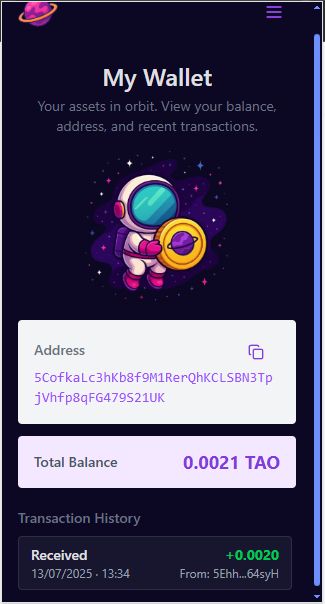
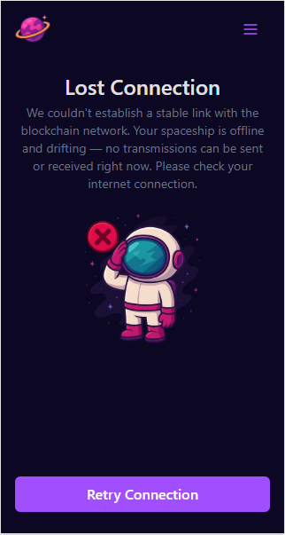
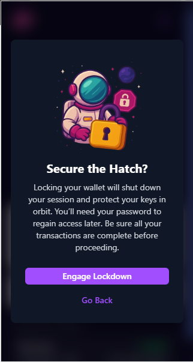
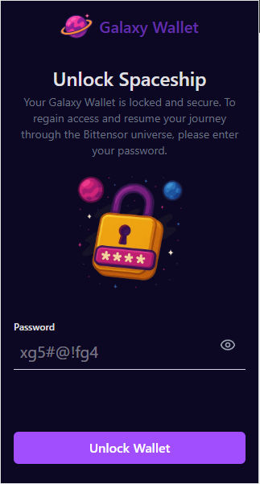
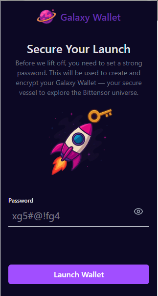
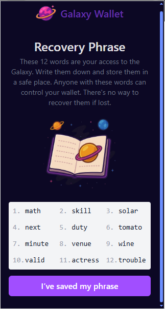
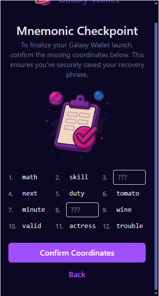
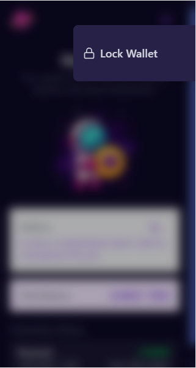

# 🚀 Galaxy Wallet - Chrome Extension

**Galaxy Wallet** is a secure and beautiful Chrome extension wallet designed to help users interact with the **Bittensor (TAO)** network. From generating your wallet to sending transactions and managing your mnemonic, everything happens in orbit — fast, safe, and with cosmic style.

## 📦 Features

- 🪐 Create and encrypt a new wallet with a password
- 🔐 Lock/Unlock session with secure password verification
- 🌌 View your address and real-time TAO balance
- 📜 View recent transactions (sent and received)
- 🚀 Smooth onboarding flow with mnemonic validation
- 🛰️ Handles connection drops gracefully
- 🌈 Fully responsive and galaxy-themed UI

## 🧱 Tech Stack

| Layer            | Technology                                                                                              |
| ---------------- | ------------------------------------------------------------------------------------------------------- |
| Frontend         | [React](https://react.dev/) + [TypeScript](https://www.typescriptlang.org/)                             |
| Build Tool       | [Vite](https://vitejs.dev/)                                                                             |
| UI Styling       | [Tailwind CSS](https://tailwindcss.com/), [Lucide Icons](https://lucide.dev/icons)                      |
| State Management | [Redux Toolkit](https://redux-toolkit.js.org/), [redux-persist](https://github.com/rt2zz/redux-persist) |
| Blockchain SDK   | [@polkadot/api](https://polkadot.js.org/docs/api/)                                                      |
| Encryption       | [crypto-js](https://www.npmjs.com/package/crypto-js)                                                    |
| Utilities        | [classnames](https://www.npmjs.com/package/classnames)                                                  |
| Dev Tools        | ESLint, TypeScript ESLint, @types/chrome                                                                |

> All dependencies are managed using Vite and yarn, optimized for Chrome extension development.

## 🧰 Setup & Installation

### 1. Install Dependencies

```bash
npm install
```

### 2. Build the App Locally

```bash
npm run dev
```

or use watch to automatically generate new build on update

```bash
npm run dev:watch
```

### 3. Load the Extension in Chrome

- Open Chrome and go to `chrome://extensions`

- Enable Developer Mode

- Click on Load unpacked

- Select the `dist` folder from the project root

### 4. Local Development Tip

For local development I strongly suggest using using the `dev:watch`, to keep the dist folder up to date, with a addon like [Extensions Reloader ](https://chromewebstore.google.com/detail/extensions-reloader/fimgfedafeadlieiabdeeaodndnlbhid) so you can quickly update the Galaxy Wallet with the new dist build files whenever you update the code.

## 📘 Usage Instructions

### 🧑‍🚀 First-Time Setup

1. **Launch Wallet** – Set a strong password
2. **Recovery Phrase** – Save your 12-word mnemonic securely
3. **Mnemonic Checkpoint** – Confirm selected words to proceed
4. **Galaxy Dashboard** – View address, balance and transactions

### 🔓 Unlocking Wallet

After being locked (manually or by timeout), the user must re-enter the password to unlock access.

### 🔐 Lock Wallet

Locking the wallet clears the session and requires password to re-enter. Trigger this from the side menu.

## 📸 Screenshots

| Feature                  | Preview                                          |
| ------------------------ | ------------------------------------------------ |
| Wallet Dashboard         |               |
| Connection Error         |                 |
| Lock Modal               |       |
| Unlock Wallet            |               |
| Launch Wallet (Password) |               |
| Show Mnemonic            |      |
| Validate Mnemonic        |  |
| Side Menu                |                   |

## ⚠️ Disclaimer

Galaxy Wallet is an educational and demonstration project. It does not store keys remotely and no data is sent to third-party services.

## 🧑‍💻 Author

Made by **Gui Benitez**  
Connect on [LinkedIn](https://linkedin.com/in/GuillermoCAB)
